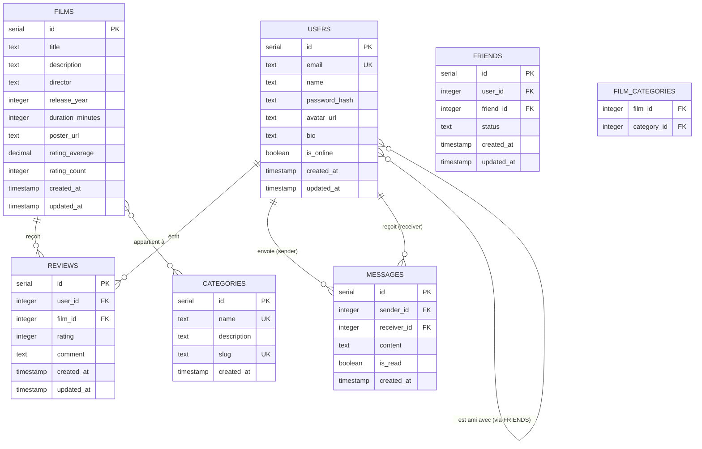

# 🗄️ Schéma de Base de Données - CinéConnect

## 📋 Vue d'ensemble

Ce document décrit le modèle conceptuel de données (MCD) et le schéma de base de données pour l'application CinéConnect, une plateforme sociale dédiée aux passionnés de cinéma.

## 🎯 Entités principales

L'application gère les entités suivantes :
- **Users** : Utilisateurs de la plateforme
- **Films** : Films disponibles sur la plateforme
- **Categories** : Catégories/genres de films
- **Reviews** : Avis et commentaires sur les films
- **Messages** : Messages de chat entre utilisateurs
- **Friends** : Relations d'amitié entre utilisateurs

---

## 📊 Diagramme Entité-Relation (ERD)

---

## 📝 Définition des Tables

### 1. Table `users`

**Description** : Stocke les informations des utilisateurs de la plateforme.

| Colonne | Type | Contraintes | Description |
|---------|------|-------------|-------------|
| `id` | `SERIAL` | PRIMARY KEY | Identifiant unique de l'utilisateur |
| `email` | `TEXT` | NOT NULL, UNIQUE | Adresse email (utilisée pour la connexion) |
| `name` | `TEXT` | NOT NULL | Nom d'affichage de l'utilisateur |
| `password_hash` | `TEXT` | NOT NULL | Hash du mot de passe (bcrypt) |
| `avatar_url` | `TEXT` | NULLABLE | URL de l'avatar de l'utilisateur |
| `bio` | `TEXT` | NULLABLE | Biographie de l'utilisateur |
| `is_online` | `BOOLEAN` | DEFAULT FALSE | Statut de connexion |
| `created_at` | `TIMESTAMP` | NOT NULL, DEFAULT NOW() | Date de création |
| `updated_at` | `TIMESTAMP` | NOT NULL, DEFAULT NOW() | Date de dernière modification |

**Index** :
- Index unique sur `email`

---

### 2. Table `films`

**Description** : Catalogue des films disponibles sur la plateforme.

| Colonne | Type | Contraintes | Description |
|---------|------|-------------|-------------|
| `id` | `SERIAL` | PRIMARY KEY | Identifiant unique du film |
| `title` | `TEXT` | NOT NULL | Titre du film |
| `description` | `TEXT` | NULLABLE | Description/synopsis du film |
| `director` | `TEXT` | NULLABLE | Nom du réalisateur |
| `release_year` | `INTEGER` | NULLABLE | Année de sortie |
| `duration_minutes` | `INTEGER` | NULLABLE | Durée en minutes |
| `poster_url` | `TEXT` | NULLABLE | URL de l'affiche du film |
| `rating_average` | `DECIMAL(3,2)` | DEFAULT 0.00 | Note moyenne (0.00 à 5.00) |
| `rating_count` | `INTEGER` | DEFAULT 0 | Nombre de notes reçues |
| `created_at` | `TIMESTAMP` | NOT NULL, DEFAULT NOW() | Date de création |
| `updated_at` | `TIMESTAMP` | NOT NULL, DEFAULT NOW() | Date de dernière modification |

**Index** :
- Index sur `title` pour la recherche
- Index sur `release_year` pour le filtrage
- Index sur `rating_average` pour le tri

---

### 3. Table `categories`

**Description** : Catégories/genres de films (Action, Comédie, Drame, etc.).

| Colonne | Type | Contraintes | Description |
|---------|------|-------------|-------------|
| `id` | `SERIAL` | PRIMARY KEY | Identifiant unique de la catégorie |
| `name` | `TEXT` | NOT NULL, UNIQUE | Nom de la catégorie |
| `description` | `TEXT` | NULLABLE | Description de la catégorie |
| `slug` | `TEXT` | NOT NULL, UNIQUE | Slug URL-friendly |
| `created_at` | `TIMESTAMP` | NOT NULL, DEFAULT NOW() | Date de création |

**Index** :
- Index unique sur `name`
- Index unique sur `slug`

---

### 4. Table `reviews`

**Description** : Avis et commentaires des utilisateurs sur les films.

| Colonne | Type | Contraintes | Description |
|---------|------|-------------|-------------|
| `id` | `SERIAL` | PRIMARY KEY | Identifiant unique de l'avis |
| `user_id` | `INTEGER` | NOT NULL, FK → users.id | Utilisateur ayant écrit l'avis |
| `film_id` | `INTEGER` | NOT NULL, FK → films.id | Film concerné |
| `rating` | `INTEGER` | NOT NULL, CHECK (1-5) | Note sur 5 étoiles |
| `comment` | `TEXT` | NULLABLE | Commentaire textuel |
| `created_at` | `TIMESTAMP` | NOT NULL, DEFAULT NOW() | Date de création |
| `updated_at` | `TIMESTAMP` | NOT NULL, DEFAULT NOW() | Date de dernière modification |

**Contraintes** :
- Un utilisateur ne peut noter qu'une seule fois un film (UNIQUE `user_id`, `film_id`)
- La note doit être entre 1 et 5

**Index** :
- Index unique composite sur (`user_id`, `film_id`)
- Index sur `film_id` pour les requêtes de film
- Index sur `user_id` pour les requêtes d'utilisateur

---

### 5. Table `messages`

**Description** : Messages de chat entre utilisateurs.

| Colonne | Type | Contraintes | Description |
|---------|------|-------------|-------------|
| `id` | `SERIAL` | PRIMARY KEY | Identifiant unique du message |
| `sender_id` | `INTEGER` | NOT NULL, FK → users.id | Utilisateur expéditeur |
| `receiver_id` | `INTEGER` | NOT NULL, FK → users.id | Utilisateur destinataire |
| `content` | `TEXT` | NOT NULL | Contenu du message |
| `is_read` | `BOOLEAN` | DEFAULT FALSE | Message lu ou non |
| `created_at` | `TIMESTAMP` | NOT NULL, DEFAULT NOW() | Date d'envoi |

**Contraintes** :
- `sender_id` ≠ `receiver_id` (un utilisateur ne peut pas s'envoyer de message)

**Index** :
- Index sur `sender_id` pour les messages envoyés
- Index sur `receiver_id` pour les messages reçus
- Index composite sur (`sender_id`, `receiver_id`, `created_at`) pour les conversations

---

### 6. Table `friends`

**Description** : Relations d'amitié entre utilisateurs.

| Colonne | Type | Contraintes | Description |
|---------|------|-------------|-------------|
| `id` | `SERIAL` | PRIMARY KEY | Identifiant unique de la relation |
| `user_id` | `INTEGER` | NOT NULL, FK → users.id | Premier utilisateur |
| `friend_id` | `INTEGER` | NOT NULL, FK → users.id | Deuxième utilisateur |
| `status` | `TEXT` | NOT NULL, DEFAULT 'pending' | Statut : 'pending', 'accepted', 'rejected' |
| `created_at` | `TIMESTAMP` | NOT NULL, DEFAULT NOW() | Date de création de la demande |
| `updated_at` | `TIMESTAMP` | NOT NULL, DEFAULT NOW() | Date de dernière modification |

**Contraintes** :
- `user_id` ≠ `friend_id` (un utilisateur ne peut pas être ami avec lui-même)
- UNIQUE (`user_id`, `friend_id`) : une seule relation entre deux utilisateurs
- `status` IN ('pending', 'accepted', 'rejected')

**Index** :
- Index unique composite sur (`user_id`, `friend_id`)
- Index sur `user_id` pour les amis d'un utilisateur
- Index sur `friend_id` pour les demandes reçues
- Index sur `status` pour filtrer les demandes

---

### 7. Table `film_categories` (Table de liaison)

**Description** : Table de liaison pour la relation many-to-many entre films et catégories.

| Colonne | Type | Contraintes | Description |
|---------|------|-------------|-------------|
| `film_id` | `INTEGER` | NOT NULL, FK → films.id | Identifiant du film |
| `category_id` | `INTEGER` | NOT NULL, FK → categories.id | Identifiant de la catégorie |

**Contraintes** :
- PRIMARY KEY composite (`film_id`, `category_id`)
- Un film peut avoir plusieurs catégories
- Une catégorie peut être associée à plusieurs films

**Index** :
- Index sur `film_id` pour les catégories d'un film
- Index sur `category_id` pour les films d'une catégorie

---

## 🔗 Relations entre Tables

### Relations 1-N (One-to-Many)

1. **Users → Reviews** (1-N)
   - Un utilisateur peut écrire plusieurs avis
   - Clé étrangère : `reviews.user_id` → `users.id`
   - Action : `ON DELETE CASCADE` (si un utilisateur est supprimé, ses avis sont supprimés)

2. **Films → Reviews** (1-N)
   - Un film peut recevoir plusieurs avis
   - Clé étrangère : `reviews.film_id` → `films.id`
   - Action : `ON DELETE CASCADE` (si un film est supprimé, ses avis sont supprimés)

3. **Users → Messages (sender)** (1-N)
   - Un utilisateur peut envoyer plusieurs messages
   - Clé étrangère : `messages.sender_id` → `users.id`
   - Action : `ON DELETE CASCADE`

4. **Users → Messages (receiver)** (1-N)
   - Un utilisateur peut recevoir plusieurs messages
   - Clé étrangère : `messages.receiver_id` → `users.id`
   - Action : `ON DELETE CASCADE`

5. **Users → Friends (user_id)** (1-N)
   - Un utilisateur peut avoir plusieurs relations d'amitié
   - Clé étrangère : `friends.user_id` → `users.id`
   - Action : `ON DELETE CASCADE`

6. **Users → Friends (friend_id)** (1-N)
   - Un utilisateur peut être l'ami de plusieurs utilisateurs
   - Clé étrangère : `friends.friend_id` → `users.id`
   - Action : `ON DELETE CASCADE`

### Relations N-N (Many-to-Many)

1. **Films ↔ Categories** (N-N)
   - Un film peut avoir plusieurs catégories
   - Une catégorie peut être associée à plusieurs films
   - Table de liaison : `film_categories`
   - Clés étrangères :
     - `film_categories.film_id` → `films.id` (ON DELETE CASCADE)
     - `film_categories.category_id` → `categories.id` (ON DELETE CASCADE)

2. **Users ↔ Users** (N-N via `friends`)
   - Un utilisateur peut être ami avec plusieurs utilisateurs
   - Relation bidirectionnelle gérée par la table `friends`
   - Contrainte : `user_id` ≠ `friend_id`

---

## 🔑 Clés Primaires et Étrangères

### Clés Primaires

| Table | Colonne(s) | Type |
|-------|------------|------|
| `users` | `id` | SERIAL |
| `films` | `id` | SERIAL |
| `categories` | `id` | SERIAL |
| `reviews` | `id` | SERIAL |
| `messages` | `id` | SERIAL |
| `friends` | `id` | SERIAL |
| `film_categories` | (`film_id`, `category_id`) | COMPOSITE |

### Clés Étrangères

| Table | Colonne | Référence | Action |
|-------|---------|-----------|--------|
| `reviews` | `user_id` | `users.id` | ON DELETE CASCADE |
| `reviews` | `film_id` | `films.id` | ON DELETE CASCADE |
| `messages` | `sender_id` | `users.id` | ON DELETE CASCADE |
| `messages` | `receiver_id` | `users.id` | ON DELETE CASCADE |
| `friends` | `user_id` | `users.id` | ON DELETE CASCADE |
| `friends` | `friend_id` | `users.id` | ON DELETE CASCADE |
| `film_categories` | `film_id` | `films.id` | ON DELETE CASCADE |
| `film_categories` | `category_id` | `categories.id` | ON DELETE CASCADE |

---

## 📈 Contraintes et Règles Métier

### Contraintes d'intégrité

1. **Unicité des emails** : Un email ne peut être utilisé que par un seul utilisateur
2. **Unicité des avis** : Un utilisateur ne peut noter qu'une seule fois un film
3. **Unicité des relations d'amitié** : Une seule relation peut exister entre deux utilisateurs
4. **Note valide** : Les notes doivent être entre 1 et 5 étoiles
5. **Statut d'amitié valide** : Le statut doit être 'pending', 'accepted' ou 'rejected'
6. **Pas d'auto-message** : Un utilisateur ne peut pas s'envoyer de message
7. **Pas d'auto-amitié** : Un utilisateur ne peut pas être ami avec lui-même

### Règles de calcul

1. **Note moyenne des films** : Calculée automatiquement à partir des notes des avis
   - `rating_average = SUM(rating) / COUNT(*)` pour chaque film
   - `rating_count = COUNT(*)` pour chaque film

---

## 🔄 Triggers et Fonctions (Optionnel)

### Mise à jour automatique de `updated_at`

Toutes les tables avec `updated_at` devraient avoir un trigger pour mettre à jour automatiquement cette colonne lors des modifications.

### Calcul automatique de la note moyenne

Un trigger peut être ajouté pour recalculer automatiquement `rating_average` et `rating_count` dans la table `films` à chaque insertion/modification/suppression d'un avis.

---

## 📊 Index Recommandés

### Index pour les performances

1. **Recherche de films** :
   - Index sur `films.title` (recherche textuelle)
   - Index sur `films.release_year` (filtrage par année)
   - Index sur `films.rating_average` (tri par note)

2. **Requêtes utilisateur** :
   - Index sur `users.email` (connexion)
   - Index sur `messages.receiver_id` (messages reçus)
   - Index sur `friends.user_id` et `friends.friend_id` (liste d'amis)

3. **Requêtes de films** :
   - Index sur `reviews.film_id` (avis d'un film)
   - Index sur `film_categories.film_id` (catégories d'un film)

---

## ✅ Validation du Schéma

### Checklist de validation

- [x] Toutes les entités principales sont définies
- [x] Les relations sont clairement documentées (1-N, N-N)
- [x] Les clés primaires sont identifiées
- [x] Les clés étrangères sont identifiées avec leurs actions
- [x] Les contraintes d'intégrité sont définies
- [x] Les index sont recommandés pour les performances
- [x] Les règles métier sont documentées

### Prochaines étapes

1. ✅ Implémenter le schéma dans Drizzle ORM
2. ✅ Générer les migrations (migration `0003_bored_sabretooth.sql` créée)
3. ✅ Appliquer les migrations à la base de données (migrations appliquées avec succès)
4. ⏳ Valider avec l'équipe
5. ✅ Créer les données de test (seed - données de test créées avec succès)

### Données de test disponibles

Le script de seed a créé :
- **4 utilisateurs** : admin@cineconnect.com, alice@cineconnect.com, bob@cineconnect.com, charlie@cineconnect.com
- **6 catégories** : Action, Comédie, Drame, Science-Fiction, Thriller, Horreur
- **6 films** : Inception, The Dark Knight, Pulp Fiction, The Matrix, Fight Club, Forrest Gump
- **Associations film-catégorie** : Films liés à leurs catégories
- **Avis** : Plusieurs avis et notes sur les films
- **Relations d'amitié** : Amitiés acceptées et en attente
- **Messages** : Messages de chat entre utilisateurs

**Mot de passe par défaut pour tous les utilisateurs** : `password123`

---

## 📝 Notes

- Le schéma est conçu pour PostgreSQL avec Drizzle ORM
- Les timestamps utilisent `TIMESTAMP` avec `DEFAULT NOW()`
- Les mots de passe sont hashés avec bcrypt (non stockés en clair)
- Les URLs (avatar, poster) sont stockées en TEXT (peuvent être des URLs complètes ou des chemins relatifs)

---

**Dernière mise à jour** : 27 janvier 2025  
**Version** : 1.0.0

